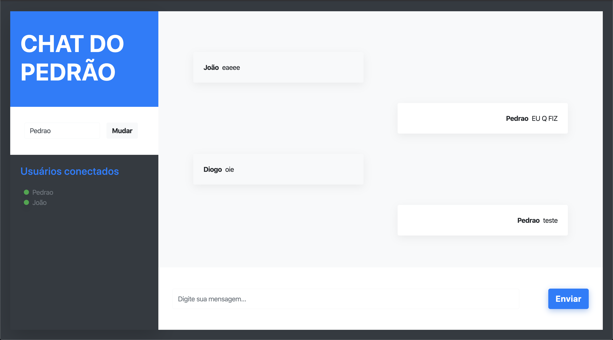

# Chat do Pedrão // Client
> Client do meu chat 😆 - Apenas pra estudos



## Instalação e Uso

Depois de ter o Yarn e o Vue CLI instalado:

```sh
yarn
```

```sh
yarn dev
```

## Online na Heroku

> 🥺 Converse conosco (<https://chatdopedrao.herokuapp.com>)
